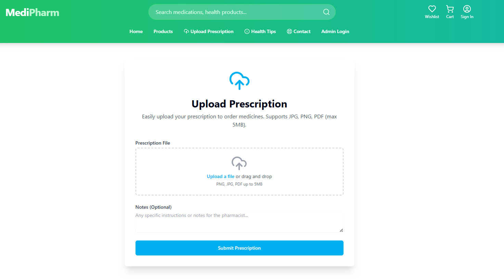
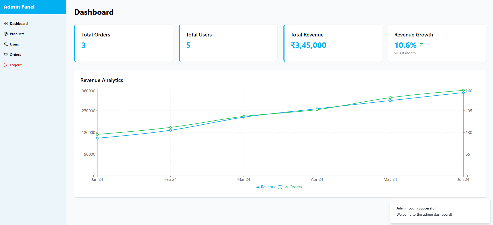
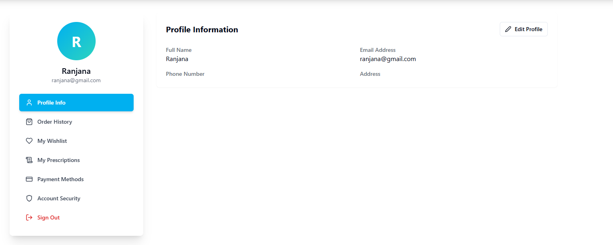
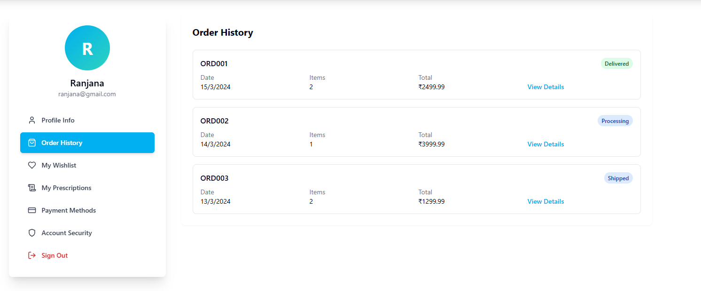
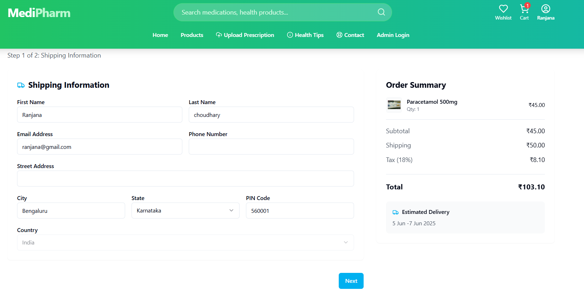
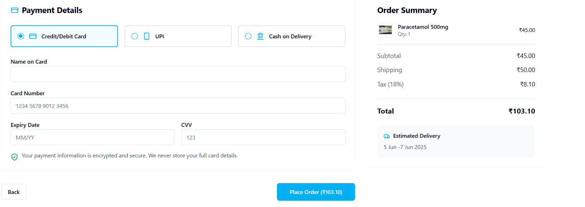
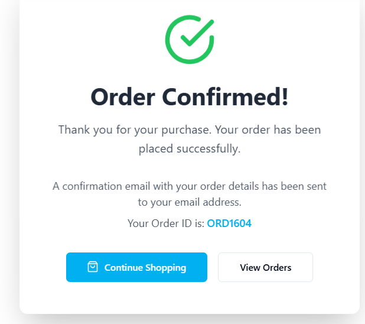

# 💊 MediPharm - Pharmacy Web Application

MediPharm is a responsive and user-friendly web application built using **React.js** that enables customers to browse, search, and order medicines and health products online. Designed with a modern UI, MediPharm aims to simplify the process of purchasing pharmaceutical products while supporting inventory management and prescription validation for pharmacies.

---

🚀 **Live Demo:** [https://medplus-pharmacy-using-reactjs.vercel.app/](https://medplus-pharmacy-using-reactjs.vercel.app/)

---
## 🚀 Features

- 🛒 **Product Catalog** - Browse a wide range of medicines and health products.
- 🔍 **Search & Filter** - Quickly find products by name, category, or brand.
- 📄 **Prescription Upload** - Upload prescriptions securely for medicine validation.
- 👨‍⚕️ **User Authentication** - Secure login/signup for customers and admins.
- 📦 **Cart & Checkout** - Add products to cart and place orders seamlessly.
- 📈 **Admin Dashboard** - Manage products, orders, and users (admin only).
- 📱 **Responsive Design** - Optimized for desktops, tablets, and mobile devices.

---

## 🛠️ Tech Stack

- **Frontend:** React.js, React Router, Context API / Redux (if used)
- **Styling:** Tailwind CSS / Bootstrap / Custom CSS
- **State Management:** React Hooks (useState, useEffect)
- **Form Handling:** React Hook Form / Formik (if used)
- **Icons & UI:** Material UI / Font Awesome
- **Backend:** (Optional - If not part of repo) Node.js, Express.js, MongoDB
- **Authentication:** JWT / Firebase Auth / Custom Auth

---
## 📸 Screenshots









---
## 📦 Installation

```bash
# Clone the repository
git clone https://github.com/your-username/medipharm.git
cd medipharm

# Install dependencies
npm install

# Start the development server
npm start
